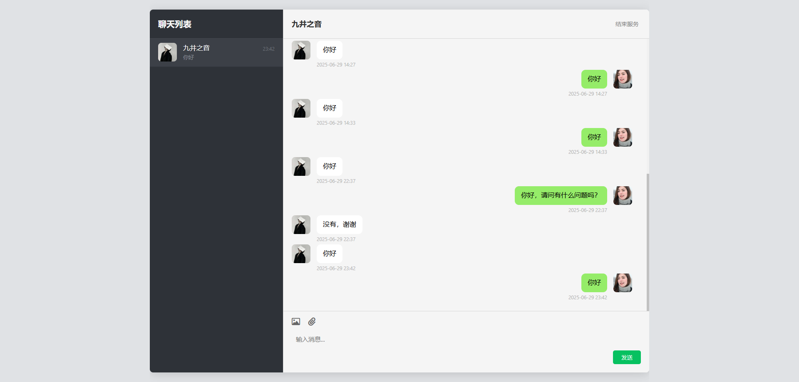
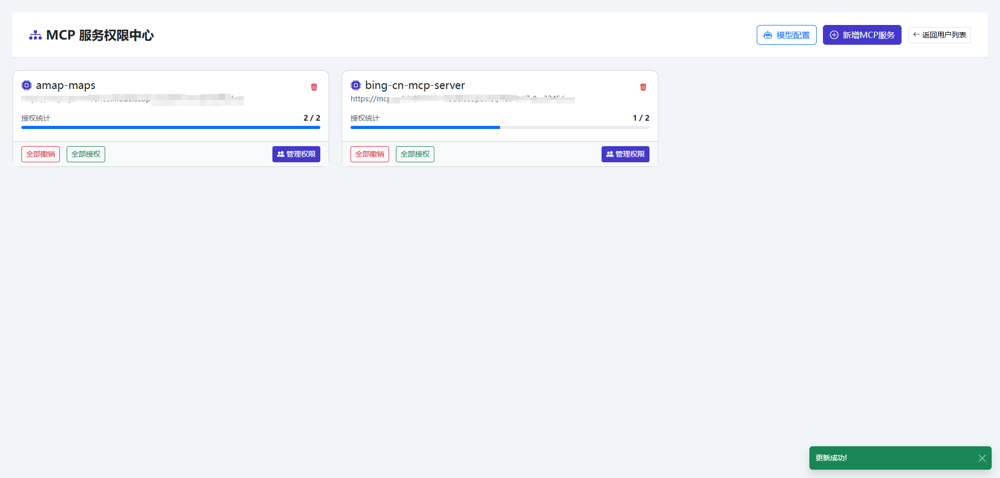
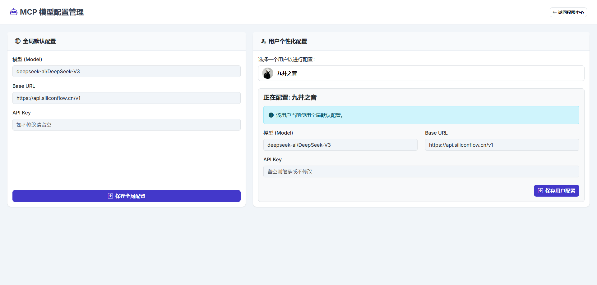

# Kn-AI-Chat 微信客服 AI 助手 (v1.3)

`kn-ai-chat` 是一个功能强大、可高度定制的微信 AI 客服助手。它基于 Java Spring Boot 框架构建，深度集成了企业微信的客服消息接口和多种先进的 AI 模型能力。

## ⚠️ 重要版本更新说明

**每次使用新版本时，必须删除原本的挂载文件夹中的 `data` 文件夹！**

由于每次更新都会更改数据库字段结构和配置格式，继续使用旧版本的数据文件可能导致：
- 数据库字段不匹配错误
- 配置文件格式冲突
- 应用启动失败

**更新步骤：**
1. 停止 Docker 容器：`docker-compose down`
2. 删除挂载的 data 目录：`rm -rf ./data`
3. 拉取最新镜像：`docker-compose pull`
4. 重新启动：`docker-compose up -d`

## 如果需要部署此项目，需要注意查看 **注意事项** 或者 `.env` 文件中的说明 - 这很重要！！！

https://github.com/user-attachments/assets/fc1c3d0d-9faa-40ef-9073-e48c567481a6

## ✨ 核心功能
该项目通过模块化的消息处理器（Handler）实现丰富的功能，并支持精细的用户级和全局级配置。

### 🧠 智能 AI 对话
- **上下文感知**: 能够理解并记忆对话历史，进行多轮对话，并且根据上下文内容判断是否启用语音回答。
- **模型可配**: 支持通过后台配置，为不同用户或全局设置不同的模型和系统提示词。

### 📚 动态知识库 (RAG)
- **即时学习**: 用户可直接发送 `.txt`, `.pdf`, `.docx`, `.csv` 等多种格式的文件，系统将自动解析并将其内容加入该用户的专属知识库。
- **精准问答**: 在回答问题时，可触发知识库模式，让 AI 基于您提供的文档内容进行回答。
- **文件管理**: 用户可通过指令（如 `列出文件`, `删除文件 <ID>`）或后台管理自己的知识库文件。

### 🗣️ 无缝人工对话
- **一键转接**: 用户可以通过关键词（如“转人工”）无缝切换到人工客服模式。
- **实时聊天界面**: 管理员可以在后台的“客服窗口”页面与用户进行实时文字、图片和文件交流。
- **会话管理**: 系统会自动管理待接入用户列表，并在管理员结束服务后自动切换回 AI 客服。

### 🌐 MCP - 模型协管平台
- **多模型管理**: 允许接入和管理多个外部模型服务（Model Copilot），并为它们创建独立的配置。
- **权限控制**: 管理员可以为每个用户精细地授权可以使用哪些 MCP 服务。
- **动态调用**: 用户可以通过特定指令（如 `#mcp-[序号] [问题]`）调用已授权的 MCP 服务进行对话。

### 🎨 AI 绘画
- **集成 SiliconFlow 的先进文生图模型**（如 `Kwai-Kolors/Kolors`）。
- **用户通过简单指令**（如 `画一张未来城市的风景`）即可触发 AI 进行绘画创作。
- **系统会自动处理图片压缩**，确保符合微信的发送限制。

### 🔊 多模态语音交互
- **语音转文本 (ASR)**: 自动识别用户发送的语音消息，并将其转换为文本进行处理。
- **文本转语音 (TTS)**: 支持将 AI 的文字回复合成为语音，并发送给用户，实现更自然的交互。
- **智能判断**: 可通过语义分析判断用户意图，自动选择是否使用语音进行回复。

### ⚙️ 强大的后台管理系统
- **用户管理**: 查看所有互动过的用户，进行拉黑/解封、清除对话历史、彻底删除用户等操作。
- **AI 配置中心**: 为全局或单个用户配置不同的 AI 模型、API Key、System Prompt 及其他多媒体模型参数。
- **MCP 服务管理**: 新增、删除和配置 MCP 服务，并管理用户对这些服务的访问权限。
- **关键词配置**: 为不同功能（如绘画、查彩票、菜单等）配置独立的触发关键词，支持用户级和全局级配置。
- **自定义回复**: 设置关键词和回复规则，实现高优先级的自动应答，支持完全匹配和包含匹配两种模式。
- **文件管理**: 查看和删除指定用户的知识库文件。
- **系统级操作**: 提供一键清除所有系统数据（用户、配置、日志、缓存）的操作。

### 🔧 高度可扩展的架构
- **处理器链**: 采用责任链模式，通过 `MessageHandler` 接口定义消息处理流程，优先级可控，易于新增功能。
- **服务化**: 核心功能（如 AI、微信、数据库、缓存）均被封装为独立的服务，逻辑清晰。
- **Docker 部署**: 提供 `docker-compose.yml`，通过环境变量注入配置，实现一键启动和便捷部署。

## 🛠️ 技术栈
- **后端**: Java 21, Spring Boot 3.5.0, Langchain4j
- **数据存储**:
  - **数据库**: H2, Spring Data JPA
  - **缓存/消息队列**: Redis (用于缓存微信 Access Token、消息去重等)
- **AI 服务**:
  - **模型接口**: SiliconFlow (默认)
  - **大语言模型**: `deepseek-ai/DeepSeek-V3` (默认)
  - **文生图模型**: `Kwai-Kolors/Kolors` (默认)
  - **语音模型**: `FunAudioLLM/SenseVoiceSmall` (ASR), `FunAudioLLM/CosyVoice2-0.5B` (TTS) (默认)
  - **多模态模型 (VLM)**: `Qwen/Qwen2-VL-72B-Instruct` (默认)
  - **RAG 嵌入模型**: `Qwen/Qwen3-Embedding-8B` (默认)
- **前端 (管理后台)**: Thymeleaf, Bootstrap 5
- **构建与部署**: Maven, Docker, Docker Compose
- **文件处理**: Apache POI (Word, Excel), Apache PDFBox (PDF), Jsoup (HTML), OpenCSV (CSV)
- **音视频处理**: JAVE (Java Audio Video Encoder)

## 📸 项目页面截图
以下是项目中各个页面的截图，展示其界面和功能：
### 管理员登录

### 用户管理

### 人工客服聊天（目前只支持文字）

### MCP 服务权限管理

### MCP 模型配置

### AI 配置

### 关键词配置

### 文件管理

### 自定义回复配置


## 微信配置
### 首先从这里扫码登录
- https://kf.weixin.qq.com/kf/loginpage?redirect_uri=https%3A%2F%2Fkf.weixin.qq.com%2Fkf%2Fframe%3Ffrom%3Dauth#/config

### 点击开发配置

### 随机获取生成的 Token
- `WECHAT_TOKEN=`

### 随机获取生成的 EncodingAESKey
- `WECHAT_AES_KEY=`

### 点击企业信息 - 企业 ID
- `WECHAT_CORP_ID=`

### 接着启动项目
- 微信回调页面设置回调 URL 为: `http://ip:port/wechat/callback`
- 验证成功后会返回 Secret

### 回调配置成功的 Secret
- `WECHAT_SECRET=`

### 点击客服账号 - 选择客服 - 账号 ID
- `WECHAT_OPEN_KFID=`

### 管理后台密码 - 默认为 xlike
- `ADMIN_PASSWORD=admin`

### AI 服务商的 API Key 
- `AI_API_KEY=sk-`

### Docker 端口
- `DOCKER_SERVER_PORT=8081`

## 📋 完整命令列表与使用说明

### 🔧 管理员命令
**使用前需要身份验证：**
```
/auth <管理员密码>    # 管理员身份验证
```
**示例：**
```
/auth admin          # 使用默认密码登录
/auth your_password  # 使用自定义密码登录
```

**管理员专用命令：**
```
/set <配置项> <值>     # 更新系统配置
/down                # 管理员退出登录
/结束                # 管理员退出登录（中文）
#<命令>              # 强制执行管理员工具
```
**示例：**
```
/set temperature 0.7      # 设置 AI 温度参数
/down                     # 退出管理员模式
```

### 🤖 AI 对话功能
**基础对话：**
- 直接发送任何文本消息即可与 AI 进行对话
- 支持上下文感知的多轮对话
- 自动判断是否启用语音回答

**示例：**
```
你好，我想了解一下人工智能的发展历史
请帮我写一个Python函数，用于计算斐波那契数列
今天天气怎么样？有什么好的旅游建议吗？
```

**语音交互：**
```
语音回答              # 强制 AI 用语音回复
语音回复              # 强制 AI 用语音回复  
用语音说              # 强制 AI 用语音回复
讲一下                # 强制 AI 用语音回复
```
**示例：**
```
语音回答 什么是机器学习？
用语音说 今天的天气预报
讲一下 春节的由来和传统习俗
语音回复 请解释一下区块链技术
```
- 支持发送语音消息，系统会自动转文字处理
- AI 可智能判断回复内容是否适合语音形式

### 🎨 AI 绘画功能
**绘画命令：**
```
画一张 <描述>         # AI 绘画创作
画一个 <描述>         # AI 绘画创作
画张 <描述>           # AI 绘画创作
画个 <描述>           # AI 绘画创作
画只 <描述>           # AI 绘画创作
画一只 <描述>         # AI 绘画创作
```

**使用示例：**
```
画一张未来城市的风景
画个可爱的小猫咪
画只在海边飞翔的海鸥
```

### 📚 知识库管理
**文件管理：**
```
列出文件              # 查看已上传的文件列表
我的文件              # 查看已上传的文件列表
文件列表              # 查看已上传的文件列表
查看文件              # 查看已上传的文件列表

删除文件 <文件ID>     # 删除指定文件
删除所有文件          # 清空个人知识库

知识库 <问题>         # 基于上传文件内容回答问题
```

**示例：**
```
列出文件              # 查看我上传了哪些文档
删除文件 12345        # 删除ID为12345的文件
删除所有文件          # 清空我的整个知识库
知识库 项目需求文档中提到的核心功能有哪些？
知识库 根据上传的产品手册，如何配置网络设置？
知识库 会议纪要中讨论的重点问题是什么？
```

**文件上传：**
- 直接发送文件（支持 .txt, .pdf, .docx, .csv 等格式）
- 系统自动解析并加入个人知识库
- 支持基于文件内容的智能问答

**文件上传示例：**
```
直接在微信中发送文件，支持格式：
✅ 产品说明书.pdf
✅ 会议纪要.docx  
✅ 数据报告.csv
✅ 技术文档.txt
✅ 项目规划.xlsx
```

### 🛠️ 系统工具
**个人数据管理：**
```
清空历史对话          # 清除聊天记录
清空记录              # 清除聊天记录
清除历史对话          # 清除聊天记录
清空聊天记录          # 清除聊天记录
清除聊天记录          # 清除聊天记录

查询id               # 查看用户ID
我的id               # 查看用户ID

对话统计              # 查看消息统计
消息统计              # 查看消息统计

我问过的问题          # 查看历史提问
历史问题              # 查看历史提问
我的提问              # 查看历史提问
```

**示例：**
```
清空历史对话          # 删除我和AI的所有聊天记录
查询id               # 显示：您的用户ID是: wx_user_123456
对话统计              # 显示：您共发送了156条消息，AI回复了145条
我问过的问题          # 显示最近提问的问题列表
```

### 🎲 彩票查询
```
大乐透                # 查询大乐透开奖结果
双色球                # 查询双色球开奖结果
今日中奖号码          # 查询彩票开奖结果
查彩票                # 查询彩票开奖结果
开奖                  # 查询彩票开奖结果
```

**示例：**
```
大乐透                # 返回：大乐透第24001期开奖号码：01 05 12 22 35 + 03 11
双色球                # 返回：双色球第24001期开奖号码：03 07 09 16 17 20 + 12
查彩票                # 返回最新一期的彩票开奖信息
```

### 👥 人工客服
**转接人工：**
```
转人工                # 转接到人工客服
人工服务              # 转接到人工客服
```

**示例：**
```
转人工                # 系统回复：正在为您转接人工客服，请稍候...
人工服务              # 系统回复：您已进入人工客服模式，客服将尽快回复您
```

**结束人工服务：**
```
结束人工服务          # 退出人工客服模式
退出                  # 退出人工客服模式
结束服务              # 退出人工客服模式
```

**示例：**
```
结束人工服务          # 系统回复：人工服务已结束，您可以继续与AI助手对话
退出                  # 回到AI助手模式
```

**特性：**
- 30分钟自动超时
- 实时 WebSocket 通知管理员
- 邮件通知新的人工服务请求
- 管理员可在后台实时聊天界面处理

### 🔗 MCP 服务（模型协管平台）
**查看可用服务：**
```
#mcp                  # 列出已授权的 MCP 服务
```

**示例：**
```
#mcp                  # 返回：您可以使用以下MCP服务：
                      # 1. 搜索服务 - Google搜索
                      # 2. 翻译服务 - 多语言翻译
                      # 3. 邮件服务 - 发送邮件
```

**使用 MCP 服务：**
```
#mcp-<序号> <问题>    # 调用指定的 MCP 服务
```

**详细示例：**
```
#mcp-1 搜索人工智能最新发展趋势
#mcp-1 查找Python机器学习教程
#mcp-2 翻译这段英文：Hello World, How are you?
#mcp-2 把"你好世界"翻译成英文
#mcp-3 发送邮件到admin@example.com，主题：会议通知
#mcp-4 查询今天的天气预报
```

### ❓ 帮助菜单
```
菜单                  # 显示功能菜单
功能                  # 显示功能菜单
帮助                  # 显示功能菜单
你能做什么            # 显示功能菜单
help                 # 显示功能菜单
menu                 # 显示功能菜单
```

**示例：**
```
菜单                  # 显示完整的功能列表和使用说明
help                 # 英文帮助菜单
你能做什么            # 系统会回复所有可用功能的详细介绍
```

**帮助菜单包含内容：**
- 🎨 AI绘画功能使用指南
- 🎲 彩票查询方法
- 📚 知识库管理说明
- 🛠️ 系统工具介绍
- 🔊 语音功能使用
- 👥 人工客服转接
- 🔗 MCP服务使用方法

## 🚀 部署与使用
### 直接下载仓库中的 `docker-compose.yml` 和 `.env` 文件，运行以下命令启动：
```bash
docker-compose up -d
```

### 版本更新命令：
```bash
# 停止服务
docker-compose down

# 删除旧数据（重要！）
rm -rf ./data

# 拉取最新镜像
docker-compose pull

# 重新启动
docker-compose up -d
```

## 📝 注意事项（必看！！！）
- **每次更新版本前必须删除 data 文件夹**，否则可能出现数据库字段不兼容问题
- 确保 Redis 服务正常运行
- 项目启动成功之后，拿到微信的 Secret 需要停止项目，重新在 `.env` 文件中配置，并且重新启动
- 所有命令关键词都支持用户级自定义配置

## 第一次打开客服聊天面板入口
- https://kf.weixin.qq.com/kf/frame?from=auth#/start
- 开始接入
- 在微信外 App/网页中接入 - 去接入
- 拿到链接，点击对话
- 后面你就可以直接在微信分享客服，就没这么麻烦了