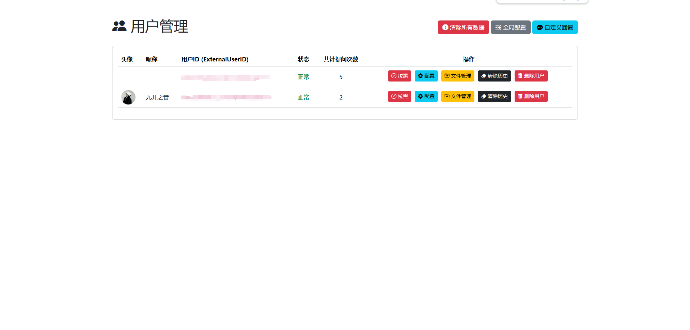
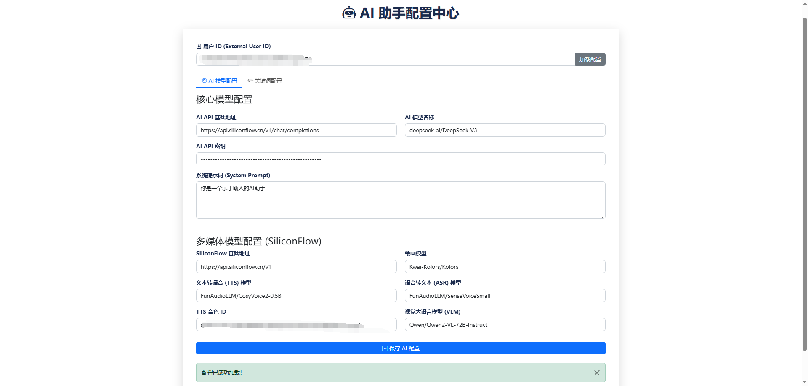

# Kn-AI-Chat 微信客服 AI 助手

`kn-ai-chat` 是一个功能强大、可高度定制的企业微信 AI 助手。它基于 Java Spring Boot 框架构建，深度集成了企业微信的客服消息接口和多种先进的 AI 模型能力，旨在为企业和个人提供智能、高效、多模态的自动化客户沟通解决方案。

## ✨ 核心功能
该项目通过模块化的消息处理器（Handler）实现丰富的功能，并支持精细的用户级和全局级配置。

### 🧠 智能 AI 对话
- **上下文感知**: 能够理解并记忆对话历史，进行多轮对话。
- **模型可配**: 支持通过后台配置，为不同用户或全局设置不同的大语言模型（LLM）和系统提示词（System Prompt）。

### 📚 动态知识库 (RAG)
- **即时学习**: 用户可直接发送 `.txt`, `.pdf`, `.docx`, `.csv` 等多种格式的文件，系统将自动解析并将其内容加入该用户的专属知识库。
- **精准问答**: 在回答问题时，可触发知识库模式，让 AI 基于您提供的文档内容进行回答。
- **文件管理**: 用户可通过指令（如 `列出文件`, `删除文件 <ID>`）或后台管理自己的知识库文件。

### 🎨 AI 绘画
- **集成 SiliconFlow 的先进文生图模型**（如 `Kwai-Kolors/Kolors`）。
- **用户通过简单指令**（如 `画一张未来城市的风景`）即可触发 AI 进行绘画创作。
- **系统会自动处理图片压缩**，确保符合微信的发送限制。

### 🔊 多模态语音交互
- **语音转文本 (ASR)**: 自动识别用户发送的语音消息，并将其转换为文本进行处理。
- **文本转语音 (TTS)**: 支持将 AI 的文字回复合成为语音，并发送给用户，实现更自然的交互。
- **智能判断**: 可通过语义分析判断用户意图，自动选择是否使用语音进行回复。

### ⚙️ 强大的后台管理系统
- **用户管理**: 查看所有互动过的用户，进行拉黑/解封、清除对话历史、彻底删除用户等操作。
- **AI 配置中心**: 为全局或单个用户配置不同的 AI 模型、API Key、System Prompt 及其他多媒体模型参数。
- **关键词配置**: 为不同功能（如绘画、查彩票、菜单等）配置独立的触发关键词，支持用户级和全局级配置。
- **自定义回复**: 设置关键词和回复规则，实现高优先级的自动应答，支持完全匹配和包含匹配两种模式。
- **文件管理**: 查看和删除指定用户的知识库文件。
- **系统级操作**: 提供一键清除所有系统数据（用户、配置、日志、缓存）的高危操作，并有密码保护。

### 🔧 高度可扩展的架构
- **处理器链**: 采用责任链模式，通过 `MessageHandler` 接口定义消息处理流程，优先级可控，易于新增功能。
- **服务化**: 核心功能（如 AI、微信、数据库、缓存）均被封装为独立的服务，逻辑清晰。
- **Docker 部署**: 提供 `docker-compose.yml`，通过环境变量注入配置，实现一键启动和便捷部署。

## 🛠️ 技术栈
- **后端**: Java 21, Spring Boot 3.5.0
- **数据存储**:
  - **数据库**: H2 (用于快速启动和开发), Spring Data JPA
  - **缓存/消息队列**: Redis (用于缓存微信 Access Token、消息去重等)
- **AI 服务**:
  - **模型接口**: SiliconFlow (默认)
  - **大语言模型**: `deepseek-ai/DeepSeek-V3` (默认)
  - **文生图模型**: `Kwai-Kolors/Kolors` (默认)
  - **语音模型**: `FunAudioLLM/SenseVoiceSmall` (ASR), `FunAudioLLM/CosyVoice2-0.5B` (TTS) (默认)
  - **多模态模型 (VLM)**: `Qwen/Qwen2-VL-72B-Instruct` (默认)
- **前端 (管理后台)**: Thymeleaf, Bootstrap 5
- **构建与部署**: Maven, Docker, Docker Compose
- **文件处理**: Apache POI (Word, Excel), Apache PDFBox (PDF), Jsoup (HTML), OpenCSV (CSV)
- **音视频处理**: JAVE (Java Audio Video Encoder)

## 📸 项目页面截图
以下是项目中各个页面的截图，展示其界面和功能：
- 
- 
- 
- 
- 
- 

## 微信配置
### 首先从这里扫码登录
- https://kf.weixin.qq.com/kf/loginpage?redirect_uri=https%3A%2F%2Fkf.weixin.qq.com%2Fkf%2Fframe%3Ffrom%3Dauth#/config

### 点击开发配置
- 首先启动项目，微信回调页面设置回调URL 为 `http://ip：端口/wechat/callback`，会返回 Secret。

### 随机获取生成的Token
- `WECHAT_TOKEN=`

### 随机获取生成的EncodingAESKey
- `WECHAT_AES_KEY=`

### 点击企业信息 - 企业ID
- `WECHAT_CORP_ID=`

### 回调配置成功的 Secret
- `WECHAT_SECRET=`

### 点击客服账号 - 选择客服 - 账号ID
- `WECHAT_OPEN_KFID=`

### 管理后台密码 - 默认为 admin
- `ADMIN_PASSWORD=admin`

### AI 服务商的 API Key
- `AI_API_KEY=sk-`

### --- Redis ---
- `REDIS_HOST=127.0.0.1`
- `REDIS_PORT=6379`
- `REDIS_PASSWORD=123456`

### Docker 端口
- `DOCKER_SERVER_PORT=8081`

## 🚀 部署与使用
